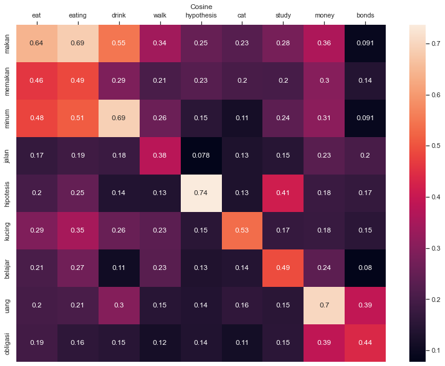
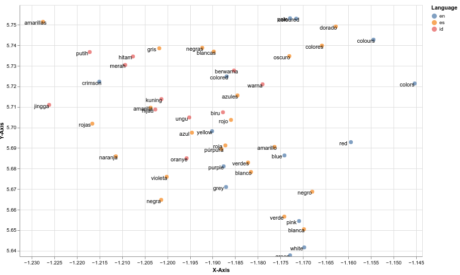
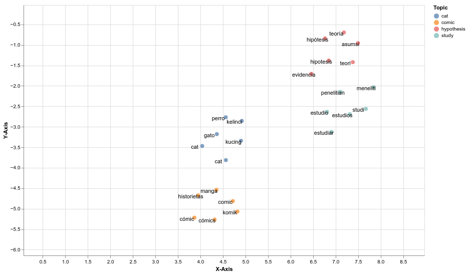

# CLEU: Cross-Lingual Embeddings Utility

CLEU is a a high-level easy to use python library that can be used to analyze cross-lingual word embeddings on multiple languages, In addition CLEU provide some interactive visualization, where users can explore the cross-lingual word embeddings on two or more languages.


## Requirements
- altair==4.1.0
- faiss==1.7.1.post2
- matplotlib==3.4.3
- numpy==1.20.3
- pandas==1.3.2
- scikit-learn==0.24.2
- scipy==1.7.1
- seaborn==0.11.2
- umap-learn==0.5.1

## Installation
CLEU is on PyPI, so you can use `pip` to install it, Currently only python 3 is supported.

```bash
pip install cleu
```

## Example
The code demonstrate how to use CLEU from loading embeddings, querying neighbours on different languages and visualizing the embeddings.

### Example: Loading the Embeddings
Load cross-lingual word embeddings for English (en), Indonesian (id) and Spanish
```python
from cleu.embeddings import Embeddings

clwe_en = Embeddings(dim=300,lang='en',cuda=False)
clwe_en.load_embeddings('data/vectors-en.txt',lang='en',max_vocab=10000)

clwe_id = Embeddings(dim=300,lang='id',cuda=False)
clwe_id.load_embeddings('data/vectors-id.txt',lang='id',max_vocab=10000)


clwe_es = Embeddings(dim=300,lang='es',cuda=False)
clwe_es.load_embeddings('data/vectors-es.txt',lang='es',max_vocab=10000)
```

### Example: Accessing the Embeddings property
Accessing the Embeddings, more property can be seen in Embedding Class
```python
# There are two ways to get the Embeddings, by word or id
# emb_you = clwe_en.get_embedding_by_id(0)
emb_you = clwe_en.get_embedding_by_word("you")
print(emb_you.vector, emb_you.id)
```

### Example: Querying Nearest Neighbours Embeddings
Find nearest neighbour of Embedding you (en) in English word embeddings
```python
neighbours_you_en = clwe_en.get_nearest_neighbours(emb_you,k=5,distance_function='cosine')
neighbours_you_en = clwe_en.get_nearest_neighbours(emb_you,k=5,distance_function='csls',csls_k=10)
```

Find nearest neighbour of Embedding you (en) in Indonesian word embeddings
```python
neighbours_you_id = clwe_id.get_nearest_neighbours(emb_you,k=5,distance_function='cosine')
neighbours_you_id = clwe_id.get_nearest_neighbours(emb_you,k=5,distance_function='csls',csls_k=10)
```

### Example: Plotting Module
Import the plotting module
```python
from cleu.plot import plot_embeddings
```

Plot Similarity Matrix between List of Embedding in English and Indonesian word embeddings
```python
words_id = ["makan","memakan","minum","jalan","hipotesis","kucing","belajar","uang","obligasi"]
words_en = ["eat","eating","drink","walk","hypothesis","cat","study","money","bonds"]
# Map each list of word to list of Embedding
emb_id = list(map(lambda word : clwe_id.get_embedding_by_word(word) ,words_id))
emb_en = list(map(lambda word : clwe_en.get_embedding_by_word(word) ,words_en))
# plot_embeddings.plot_similarity(emb_id,emb_en,distance_function='csls',csls_k=3)
plot_embeddings.plot_similarity(emb_id,emb_en,distance_function='cosine')
```


Reduce Dimensionality and plot English, Indonesian and Spanish cross-lingual word embeddings on 2d plane
```python
import altair as alt
# If you have more than 5000 embedding, uncomment the line below 
# alt.data_transformers.disable_max_rows()
plot_embeddings.plot_embeddings_2d([clwe_en,clwe_id,clwe_es],width=800,height=500,dimensionality_reduction='umap')
```



Find English words nearest neighbours in Indonesian and Spanish cross-lingual word embeddings and plot it on 2d plance
```python
words_en = ["hypothesis","cat","study","comic"]
emb_en = list(map(lambda word : clwe_en.get_embedding_by_word(word) ,words_en))
plot_embeddings.plot_embeddings_neighbours(emb_en,[clwe_id,clwe_es],width=800,height=500,dimensionality_reduction='umap',k=3,distance_function='csls',csls_k=10)
```


## Support
- Open bug reports and feature requests on GitHub issues.

## License
CLEU is licensed under the MIT.
